# Texts to Transformer

Train a tiny reply model or a pretrained personal rewrite adapter on your iMessage history,
entirely on your Mac.

This repository contains the complete pipeline: safe Messages database snapshotting, text
extraction and pseudonymization, leakage-resistant dataset splits, tokenizer training, a custom
decoder-only Transformer, MLX training, evaluation, memorization checks, model export, and a local
terminal chat interface. The rewrite path adds isolated BART LoRA and Qwen QLoRA environments.

The reply path and legacy tiny rewrite baseline start from zero. The recommended rewrite path uses
a pinned pretrained BART base and keeps the private adapter separate and local.

> [!IMPORTANT]
> This builds a small personal style model, not a generally capable assistant. It can learn your
> phrasing, rhythm, slang, and common responses, but it will not reliably reason or answer factual
> questions. The resulting model may memorize private text and must remain private.

## What you will build

The default small preset is a 4-layer, 1.38M-parameter decoder-only Transformer with a custom
4,096-token byte-level BPE tokenizer and a 256-token context window. A larger 6.16M-parameter
preset is included for unusually large message histories.

```mermaid
flowchart LR
    A["Messages chat.db"] -->|"read-only SQLite backup"| B["Private snapshot"]
    B --> C["Extract + pseudonymize"]
    C --> D["Conversation sessions"]
    D --> E["Chronological train / validation / test"]
    E --> F["Train custom tokenizer"]
    F --> G["Initialize Transformer randomly"]
    G --> H["Train + evaluate with MLX"]
    H --> I["Local reply generator"]
```



An example development run used roughly 8M training tokens and produced a 1.38M-parameter model
that generated short replies in the owner's writing style.

## Safety and privacy

Read [the privacy documentation](docs/privacy.md) before running the data pipeline.

- `~/Library/Messages/chat.db` is opened in SQLite read-only mode and is never modified.
- Processing happens from a consistent private backup under `work/`, never from the live database.
- Attachments are never opened or copied.
- Handles and chat identifiers are replaced with keyed HMAC pseudonyms before JSONL is written.
- URLs, email addresses, and phone-number-shaped strings are redacted by default.
- Raw messages are never printed in normal logs.
- Datasets, tokenizers, checkpoints, and final weights are excluded from Git.
- Local training/inference never uploads data or sends an iMessage. The explicitly optional OpenAI
  pair generator is the documented exception; `chat` and `rewrite-adapter` only print text.

Pseudonymization is not anonymization. Keep `work/` and `outputs/` on a FileVault-protected Mac and
never commit, upload, or share them.

## Requirements

- An Apple Silicon Mac (M1 or newer)
- macOS 14 or newer
- At least 16 GB of unified memory recommended
- Enough free disk space for a private copy of `chat.db` and training artifacts
- [Homebrew](https://brew.sh/) or another way to install `uv`
- Full Disk Access for Terminal, Codex, or whichever app runs the snapshot command

The main project uses Python 3.11 and pins MLX 0.32.0. The recommended adapter workflow installs
PyTorch/PEFT and MLX-LM only in ignored, isolated environments under `work/envs/`.

## Install

```bash
git clone https://github.com/Doriandarko/texts-to-transformer.git
cd texts-to-transformer

# Skip this if uv is already installed.
brew install uv

uv sync
uv run imessage-mlx doctor
```

If this project lives under macOS `Documents` and `uv run` cannot import `imessage_mlx`, use:

```bash
export UV_NO_EDITABLE=1
uv sync --no-editable
```

This avoids a macOS hidden-`.pth` issue. Re-run the sync after source changes.

`doctor` verifies Apple Silicon, MLX Metal support, disk space, Git ignore coverage, private
directory permissions, and read-only access to the Messages database.

### Grant Full Disk Access

If `safe_to_snapshot_real_data` is `false`, open:

```text
System Settings → Privacy & Security → Full Disk Access
```

Enable the application running the command, completely restart that application, and rerun:

```bash
uv run imessage-mlx doctor
```

Do not copy the live database manually or change its permissions as a workaround.

## Train your model

Run these commands from the repository root. The commands print aggregate counts and metrics, not
message text.

### 1. Create a safe database snapshot

```bash
uv run imessage-mlx snapshot --config configs/data.yaml
```

This uses SQLite's online backup API, writes `work/snapshot/chat.db`, hashes the snapshot, and runs
`PRAGMA quick_check`.

### 2. Inspect the local Messages schema

```bash
uv run imessage-mlx inspect-schema \
  --database work/snapshot/chat.db \
  --output work/schema/schema.json
```

Apple changes the Messages schema between macOS versions, so the extractor inspects the local
schema instead of assuming an internet example is correct.

### 3. Build the private dataset

```bash
uv run imessage-mlx prepare --config configs/data.yaml
uv run imessage-mlx privacy-audit
```

This stage:

1. Recovers ordinary text and Apple typedstream `attributedBody` text.
2. Filters reactions, system events, deleted messages, and attachment-only rows.
3. Redacts obvious identifiers and pseudonymizes database identities.
4. Groups messages into six-hour conversation sessions.
5. Removes duplicate sessions.
6. Creates chronological 90/5/5 splits with seven-day guard bands.
7. Verifies that no duplicate session hash appears across splits.

The command stops instead of silently continuing when recovery or privacy checks fail.

### 4. Train the tokenizer

```bash
uv run imessage-mlx train-tokenizer \
  --train work/splits/train.jsonl \
  --output outputs/tokenizer \
  --vocab-size 4096
```

Only the training split is used. The byte-level BPE tokenizer preserves emoji, casing, punctuation,
multilingual text, slang, and unusual spelling.

### 5. Encode the corpus and select a model size

```bash
uv run imessage-mlx corpus-stats \
  --splits work/splits \
  --tokenizer outputs/tokenizer \
  --output work/tokens
```

Read `work/reports/model-selection.json`. The reply pipeline refuses real training below one million
tokens and selects the largest reply preset supported by the corpus. Rewrite training uses the
separate task-specific policy documented below.

### 6. Train from random initialization

Most people should use the selected 1M preset:

```bash
uv run imessage-mlx train \
  --config configs/model-1m.yaml \
  --data work/tokens \
  --tokenizer outputs/tokenizer \
  --output outputs/runs/my-model
```

If `model-selection.json` explicitly selects `model-7m`, use `configs/model-7m.yaml` instead.

Training uses next-token cross-entropy, AdamW, learning-rate warmup and cosine decay, gradient
clipping, compiled MLX updates, validation-based checkpoint selection, and resumable checkpoints.

Resume an interrupted run with:

```bash
uv run imessage-mlx train \
  --config configs/model-1m.yaml \
  --data work/tokens \
  --tokenizer outputs/tokenizer \
  --output outputs/runs/my-model \
  --resume-from outputs/runs/my-model/last
```

### 7. Evaluate the untouched test split

```bash
uv run imessage-mlx evaluate \
  --checkpoint outputs/runs/my-model/best \
  --data work/tokens \
  --output outputs/evaluation.json
```

The report includes overall and `me`-turn perplexity, a unigram baseline, exact train n-gram overlap
aggregates, and obvious-PII pattern counts. Matching private text is never persisted in the report.

### 8. Export the local model

```bash
uv run imessage-mlx export \
  --checkpoint outputs/runs/my-model/best \
  --metrics outputs/evaluation.json \
  --output outputs/final
```

The exported directory includes inference weights, model configuration, tokenizer, aggregate
metrics, and dataset hashes. Optimizer state and source messages are excluded.

### 9. Generate reply suggestions

```bash
uv run imessage-mlx chat --model outputs/final
```

Example interaction:

```text
Local MLX reply generator. Type /quit to exit. Nothing will be sent.
other: hey, are you around later?
me: yeah should be! what time?
```

The prompt labeled `other:` is the incoming message. The text labeled `me:` is the model's suggested
reply. The command remembers earlier turns until `/quit`, but it never sends anything.

For shorter, less chaotic generations:

```bash
uv run imessage-mlx chat \
  --model outputs/final \
  --temperature 0.5 \
  --top-p 0.8 \
  --max-new-tokens 24 \
  --repetition-penalty 1.2
```

## Experimental casual rewrite mode

Rewrite mode trains a separate model to transform a neutral draft into the owner's casual texting
style. Prepare private JSONL where the neutral version is the input and the original user-authored
message is the target:

```json
{"pair_id":"p1","timestamp_ns":1000000000,"neutral_text":"I will be there at seven.","styled_text":"ill be there at 7"}
```

Never reverse these fields. `styled_text` is the text whose style the model learns. Pair files,
splits, token arrays, tokenizers, and model artifacts stay under the ignored private directories.

### Recommended local pretrained-adapter path

The recommended rewrite model is a locally trained `facebook/bart-base` seq2seq LoRA adapter. The
older 291K random-initialized Transformer remains available only as a rollback baseline. On the
24 GB M4 balanced clean-split benchmark, BART used about 3.05 GB peak memory and processed about 6.7
examples/second after sustained load. The matched 100-iteration Qwen3-0.6B QLoRA spike used about
0.67 GB but produced repeated,
malformed outputs, so BART won the content/style/fluency gate.

Allow roughly 8 GB of free disk for isolated environments, model caches, adapters, and rollback
artifacts. The measured full BART run is expected to take about 4–4.5 hours under sustained thermal
load on the benchmarked machine. It uses deterministic decoding, stores adapters separately from
the base model, and never uploads or fuses the adapter.

The configs pin the exact downloaded model revisions. The `facebook/bart-base` Hugging Face model
card does not declare a license; review the upstream model and fairseq terms before distributing
anything. This project treats both base and adapter artifacts as local-only.

Adapter preparation removes cross-split normalized/fuzzy duplicates, protected-fact conflicts, and
messages over 512 characters. It reports the untouched signal strata, then caps exact and
surface-only training examples to one quarter of the substantive stratum each. This prevents
identity examples from dominating without inflating any unique-data report. The BART worker applies
a final 256-token source/target check and reports every skipped outlier.

The completed local run trained on 32,812 accepted pairs for about 4.1 hours and reached 0.922
validation loss. On 1,589 held-out pairs it preserved protected facts in 99.18% of outputs, reached
0.953 mean local semantic similarity, closed 85.4% of the measured style-marker gap and 55.4% of the
target lexical-change gap, and produced no empty, repeated, or malformed outputs. These figures are
specific to this private corpus; the review requirement still applies.

### Multi-register convergence pilot

The convergence pipeline teaches several English formulations of one meaning to map to the same
user-written target. Stage A sends the accepted target to OpenAI for structured semantic extraction.
Stage B is a separate request that receives only that semantic JSON and generates formal,
everyday-neutral, verbose-indirect, and terse-conversational sources. Both requests use
`store=False`; Stage B never receives the original wording.

Run a small pilot before scaling. The example below selects 40 training targets, five validation
targets, and five untouched test targets. Prompt/model/input fingerprints make interrupted runs
resumable and prevent incompatible artifacts from being mixed.

```bash
uv run imessage-mlx generate-convergence-pilot \
  --model gpt-5.6-luna \
  --train-targets 40 \
  --validation-targets 5 \
  --test-targets 5 \
  --output work/rewrite/convergence/pilot-50

uv run imessage-mlx validate-convergence-data-semantics \
  --environment work/envs/bart \
  --pairs work/rewrite/convergence/pilot-50/published.jsonl \
  --output work/rewrite/convergence/pilot-50/semantic-validated.jsonl

uv run imessage-mlx prepare-convergence-adapters \
  --pairs work/rewrite/convergence/pilot-50/semantic-validated.jsonl \
  --output work/rewrite/convergence/adapters-50

uv run imessage-mlx train-adapter \
  --config configs/adapter-bart-base.yaml \
  --environment work/envs/bart \
  --data work/rewrite/convergence/adapters-50 \
  --output outputs/adapters/bart-convergence-50
```

Preparation publishes only complete four-source target groups. It checks protected facts, local
semantic similarity, sibling diversity, target lineage, and cross-split leakage. Evaluation runs the
current and pilot adapters on the same challenge file, reports each register separately, measures
copying and within-target convergence, and produces a private 50-group review. Pilot artifacts never
replace the promoted adapter automatically.

```bash
uv run imessage-mlx prepare-adapters
uv run imessage-mlx setup-adapter-environment bart --output work/envs/bart
uv run imessage-mlx setup-adapter-environment qwen --output work/envs/mlx-lm

uv run imessage-mlx train-adapter \
  --config configs/adapter-bart-base.yaml \
  --environment work/envs/bart \
  --output outputs/adapters/bart-base-full

uv run imessage-mlx predict-adapter \
  --config configs/adapter-bart-base.yaml \
  --environment work/envs/bart \
  --adapter outputs/adapters/bart-base-full \
  --output work/rewrite/evaluation/bart-full.jsonl

uv run imessage-mlx evaluate-rewrite-semantics \
  --predictions work/rewrite/evaluation/bart-full.jsonl \
  --environment work/envs/bart \
  --output work/rewrite/evaluation/bart-full-semantic.json

uv run imessage-mlx evaluate-rewrite-adapter \
  --predictions work/rewrite/evaluation/bart-full.jsonl \
  --semantic-report work/rewrite/evaluation/bart-full-semantic.json \
  --output work/rewrite/evaluation/bart-full-report.json

uv run imessage-mlx predict-legacy-rewrite \
  --test work/rewrite/adapters/bart/test.jsonl \
  --output work/rewrite/evaluation/legacy-291k.jsonl

uv run imessage-mlx review-rewrite-models \
  --adapter work/rewrite/evaluation/bart-full.jsonl \
  --legacy work/rewrite/evaluation/legacy-291k.jsonl

uv run imessage-mlx promote-adapter \
  --adapter outputs/adapters/bart-base-full \
  --evaluation work/rewrite/evaluation/bart-full-report.json

uv run imessage-mlx rewrite-adapter "I will be there at seven."
```

Promotion is blocked unless the held-out content, style, fluency, and memorization checks pass. A
previous promoted artifact is moved to a timestamped rollback directory. Review every generated
message and complete the private comparison checklist before replacing the baseline; no command
sends messages automatically.

Pairs can be supplied manually or generated from recent outgoing messages with OpenAI. The original
neutral-pair generator sends redacted message text. The convergence generator sends the complete
accepted `styled_text` to Stage A because that is the authorized source of meaning; Stage B sees only
semantic JSON. Review the provider policy before running either command. Message content is never
printed or written to aggregate reports. Put the credential in the ignored `.env` file:

```text
OPENAI_API_KEY=your_key_here
OPENAI_MODEL=gpt-5.5
```

The following from-scratch workflow is retained for baseline comparison:

```bash
uv run imessage-mlx generate-rewrite-pairs --limit 500
uv run imessage-mlx review-rewrite-pairs --sample-size 50
uv run imessage-mlx prepare-rewrites

uv run imessage-mlx train-tokenizer \
  --train work/rewrite/splits/train.jsonl \
  --output outputs/rewrite-tokenizer \
  --vocab-size 2048

uv run imessage-mlx rewrite-corpus-stats

uv run imessage-mlx train \
  --config configs/model-rewrite-290k.yaml \
  --data work/rewrite/tokens \
  --tokenizer outputs/rewrite-tokenizer \
  --output outputs/runs/rewrite-model \
  --selection-report work/rewrite/reports/model-selection.json

uv run imessage-mlx export \
  --checkpoint outputs/runs/rewrite-model/best \
  --output outputs/rewrite-final \
  --split-report work/rewrite/reports/split-report.json \
  --splits work/rewrite/splits

uv run imessage-mlx rewrite \
  "I will be there at seven." \
  --model outputs/rewrite-final
```

Rewrite training applies loss only to `styled_text`, not to the neutral prompt or padding. The
rewrite selector examines the training split only and requires at least 10,000 unique pairs, 100,000
supervised target tokens, and 1.5 target tokens per model parameter. It selects the largest eligible
rewrite preset with no unsafe fallback. The 1.5 ratio is intentionally experimental and more
memorization-prone than the reply model's safety policy.

These task-specific thresholds are still heuristics, not a quality guarantee. This tiny model may
change meaning or memorize private text, so review every result before sending it. The standard
`evaluate` command remains reply-specific and rejects rewrite checkpoints rather than reporting
unmasked, misleading metrics.

## What this model can and cannot do

It can learn:

- Common greetings and sign-offs
- Your average response length
- Punctuation, emoji, slang, and casing patterns
- Frequently repeated conversational structures

It does not reliably learn:

- Arithmetic or factual knowledge
- Multi-step reasoning
- Long-term memory beyond its context window
- The capabilities of a pretrained assistant model

Making the architecture larger without adding more unique training text usually increases
memorization rather than intelligence. If you want general reasoning plus personal style, fine-tune
a pretrained model. The reply path retains the from-scratch implementation for study, while the
recommended rewrite path now uses a local pretrained LoRA adapter for semantic reliability.

## Included model presets

| Preset | Layers | Width | Heads | MLP width | Context | Vocabulary | Approx. parameters |
| --- | ---: | ---: | ---: | ---: | ---: | ---: | ---: |
| `model-1m` | 4 | 128 | 4 | 384 | 256 | 4,096 | 1.38M |
| `model-7m` | 6 | 256 | 8 | 768 | 512 | 4,096 | 6.16M |
| `model-rewrite-190k` | 3 | 48 | 4 | 144 | 256 | 2,048 | 188K |
| `model-rewrite-290k` | 3 | 64 | 4 | 192 | 256 | 2,048 | 291K |

See [the architecture guide](docs/architecture.md) for the model, data, and checkpoint design.

## Validate everything

```bash
uv run ruff check .
uv run ruff format --check .
uv run pytest -q
git diff --check
git ls-files work outputs
```

The final command must print nothing. The test suite uses synthetic SQLite and JSONL fixtures only.
It covers snapshot immutability, attributed-body decoding, extraction accounting, pseudonymization,
split isolation, tokenizer behavior, causal and target-only masking, one-batch overfitting,
checkpoint resume, compiled MLX training, evaluation, export, and fresh-process inference.

After a real run, perform the aggregate Gate A-D audit:

```bash
uv run imessage-mlx audit \
  --run outputs/runs/my-model \
  --model outputs/final
```

The audit writes aggregate evidence to `work/reports/completion-audit.json` and exits nonzero unless
every required gate passes.

## Troubleshooting

See [the troubleshooting guide](docs/troubleshooting.md) for Full Disk Access failures, insufficient
data, interrupted runs, strange output, and privacy audit failures.

## Project structure

```text
configs/                    data and model presets
src/imessage_mlx/data/      snapshot, extraction, privacy, sessions, splits, rewrite pairs
src/imessage_mlx/model/     decoder-only Transformer implementation
src/imessage_mlx/tokenizer/ local tokenizer training
src/imessage_mlx/train.py   MLX training loop
src/imessage_mlx/evaluate.py held-out and memorization evaluation
src/imessage_mlx/generate.py local autoregressive generation
tests/                      synthetic-only test suite
work/                       ignored private datasets and reports
outputs/                    ignored private tokenizers, checkpoints, and models
```

## License

[MIT](LICENSE)
