# Texts to Transformer

Train a tiny reply model or a pretrained personal rewrite adapter on your iMessage history,
entirely on your Mac.

This repository contains the complete pipeline: safe Messages database snapshotting, text
extraction and pseudonymization, leakage-resistant dataset splits, tokenizer training, a custom
decoder-only Transformer, MLX training, evaluation, memorization checks, model export, and a local
terminal chat interface. The rewrite path builds its training data entirely through hosted GPT
decisions — generation, judging, and a final content censor — and trains isolated BART LoRA (or
Qwen QLoRA) adapters locally.

The reply path starts from zero. The rewrite path uses a pinned pretrained BART base and keeps the
private adapter separate and local.

> [!IMPORTANT]
> This builds a small personal style model, not a generally capable assistant. It can learn your
> phrasing, rhythm, slang, and common responses, but it will not reliably reason or answer factual
> questions. The resulting model may memorize private text and must remain private.

## What you will build

The default small preset is a 4-layer, 1.38M-parameter decoder-only Transformer with a custom
4,096-token byte-level BPE tokenizer and a 256-token context window. A larger 6.16M-parameter
preset is included for unusually large message histories.

```mermaid
flowchart LR
    A["Messages chat.db"] -->|"read-only SQLite backup"| B["Private snapshot"]
    B --> C["Extract + pseudonymize"]
    C --> D["Conversation sessions"]
    D --> E["Chronological train / validation / test"]
    E --> F["Train custom tokenizer"]
    F --> G["Initialize Transformer randomly"]
    G --> H["Train + evaluate with MLX"]
    H --> I["Local reply generator"]
```



An example development run used roughly 8M training tokens and produced a 1.38M-parameter model
that generated short replies in the owner's writing style.

## Safety and privacy

Read [the privacy documentation](docs/privacy.md) before running the data pipeline.

- `~/Library/Messages/chat.db` is opened in SQLite read-only mode and is never modified.
- Processing happens from a consistent private backup under `work/`, never from the live database.
- Attachments are never opened or copied.
- Handles and chat identifiers are replaced with keyed HMAC pseudonyms before JSONL is written.
- With `include_contact_names: true`, sender display names from macOS Contacts are retained while
  raw phone numbers and email handles remain omitted.
- URLs, email addresses, and phone-number-shaped strings are redacted by default.
- Raw messages are never printed in normal logs.
- Datasets, tokenizers, checkpoints, and final weights are excluded from Git.
- Local training/inference never uploads data or sends an iMessage. The explicitly optional OpenAI
  dataset builder and censor (`build-llm-dataset`, `censor-llm-dataset`) are the documented
  exceptions; `chat` and `rewrite-adapter` only print text.

Pseudonymization is not anonymization. Keep `work/` and `outputs/` on a FileVault-protected Mac and
never commit, upload, or share them.

## Requirements

- An Apple Silicon Mac (M1 or newer)
- macOS 14 or newer
- At least 16 GB of unified memory recommended
- Enough free disk space for a private copy of `chat.db` and training artifacts
- [Homebrew](https://brew.sh/) or another way to install `uv`
- Full Disk Access for Terminal, Codex, or whichever app runs the snapshot command

The main project uses Python 3.11 and pins MLX 0.32.0. The recommended adapter workflow installs
PyTorch/PEFT and MLX-LM only in ignored, isolated environments under `work/envs/`.

## Install

```bash
git clone https://github.com/Doriandarko/texts-to-transformer.git
cd texts-to-transformer

# Skip this if uv is already installed.
brew install uv

uv sync
uv run imessage-mlx doctor
```

If this project lives under macOS `Documents` and `uv run` cannot import `imessage_mlx`, use:

```bash
export UV_NO_EDITABLE=1
uv sync --no-editable
```

This avoids a macOS hidden-`.pth` issue. Re-run the sync after source changes.

`doctor` verifies Apple Silicon, MLX Metal support, disk space, Git ignore coverage, private
directory permissions, and read-only access to the Messages database.

### Grant Full Disk Access

If `safe_to_snapshot_real_data` is `false`, open:

```text
System Settings → Privacy & Security → Full Disk Access
```

Enable the application running the command, completely restart that application, and rerun:

```bash
uv run imessage-mlx doctor
```

Do not copy the live database manually or change its permissions as a workaround.

## Train your model

Run these commands from the repository root. The commands print aggregate counts and metrics, not
message text.

### 1. Create a safe database snapshot

```bash
uv run imessage-mlx snapshot --config configs/data.yaml
```

This uses SQLite's online backup API, writes `work/snapshot/chat.db`, hashes the snapshot, and runs
`PRAGMA quick_check`.

### 2. Inspect the local Messages schema

```bash
uv run imessage-mlx inspect-schema \
  --database work/snapshot/chat.db \
  --output work/schema/schema.json
```

Apple changes the Messages schema between macOS versions, so the extractor inspects the local
schema instead of assuming an internet example is correct.

### 3. Build the private dataset

```bash
uv run imessage-mlx prepare --config configs/data.yaml
uv run imessage-mlx privacy-audit
uv run imessage-mlx export-messages-csv
```

This stage:

1. Recovers ordinary text and Apple typedstream `attributedBody` text.
2. Filters reactions, system events, deleted messages, and attachment-only rows.
3. Redacts obvious identifiers, pseudonymizes database identities, and—when configured—adds local
   Contacts display names without persisting raw handles.
4. Groups messages into six-hour conversation sessions.
5. Removes duplicate sessions.
6. Creates chronological 90/5/5 splits with seven-day guard bands.
7. Verifies that no duplicate session hash appears across splits.

The command stops instead of silently continuing when recovery or privacy checks fail.
The optional CSV export writes the same private message rows to
`work/extracted/messages.csv` with a readable local timestamp for spreadsheet browsing.

### 4. Train the tokenizer

```bash
uv run imessage-mlx train-tokenizer \
  --train work/splits/train.jsonl \
  --output outputs/tokenizer \
  --vocab-size 4096
```

Only the training split is used. The byte-level BPE tokenizer preserves emoji, casing, punctuation,
multilingual text, slang, and unusual spelling.

### 5. Encode the corpus and select a model size

```bash
uv run imessage-mlx corpus-stats \
  --splits work/splits \
  --tokenizer outputs/tokenizer \
  --output work/tokens
```

Read `work/reports/model-selection.json`. The reply pipeline refuses real training below one million
tokens and selects the largest reply preset supported by the corpus. Rewrite training uses the
separate task-specific policy documented below.

### 6. Train from random initialization

Most people should use the selected 1M preset:

```bash
uv run imessage-mlx train \
  --config configs/model-1m.yaml \
  --data work/tokens \
  --tokenizer outputs/tokenizer \
  --output outputs/runs/my-model
```

If `model-selection.json` explicitly selects `model-7m`, use `configs/model-7m.yaml` instead.

Training uses next-token cross-entropy, AdamW, learning-rate warmup and cosine decay, gradient
clipping, compiled MLX updates, validation-based checkpoint selection, and resumable checkpoints.

Resume an interrupted run with:

```bash
uv run imessage-mlx train \
  --config configs/model-1m.yaml \
  --data work/tokens \
  --tokenizer outputs/tokenizer \
  --output outputs/runs/my-model \
  --resume-from outputs/runs/my-model/last
```

### 7. Evaluate the untouched test split

```bash
uv run imessage-mlx evaluate \
  --checkpoint outputs/runs/my-model/best \
  --data work/tokens \
  --output outputs/evaluation.json
```

The report includes overall and `me`-turn perplexity, a unigram baseline, exact train n-gram overlap
aggregates, and obvious-PII pattern counts. Matching private text is never persisted in the report.

### 8. Export the local model

```bash
uv run imessage-mlx export \
  --checkpoint outputs/runs/my-model/best \
  --metrics outputs/evaluation.json \
  --output outputs/final
```

The exported directory includes inference weights, model configuration, tokenizer, aggregate
metrics, and dataset hashes. Optimizer state and source messages are excluded.

### 9. Generate reply suggestions

```bash
uv run imessage-mlx chat --model outputs/final
```

Example interaction:

```text
Local MLX reply generator. Type /quit to exit. Nothing will be sent.
other: hey, are you around later?
me: yeah should be! what time?
```

The prompt labeled `other:` is the incoming message. The text labeled `me:` is the model's suggested
reply. The command remembers earlier turns until `/quit`, but it never sends anything.

For shorter, less chaotic generations:

```bash
uv run imessage-mlx chat \
  --model outputs/final \
  --temperature 0.5 \
  --top-p 0.8 \
  --max-new-tokens 24 \
  --repetition-penalty 1.2
```

## Casual rewrite mode

Rewrite mode trains a separate model to transform an upstream assistant's draft into the owner's
casual texting style. The owner's real messages are always the training target; the paired inputs
are assistant-style drafts generated by a hosted GPT model.

### LLM-only dataset pipeline

The dataset pipeline contains no heuristic rules. Local code only slices each chat into fixed-size
message windows, checkpoints finished windows, and serializes results; every data decision is made
by the configured OpenAI model through structured-output calls:

1. **Propose.** The model reads the window (numbered messages, first-name speaker labels, local
   timestamps) and decides how the owner's bubbles group into turns, which turns are usable, and
   what a generic polished assistant would have drafted to express the same meaning. It translates
   slang from its own knowledge and the conversation, keeps proper nouns verbatim, and writes a
   one-sentence context note for human review.
2. **Judge.** A second call re-reads the window plus the proposed pairs and accepts or rejects each
   one: same meaning, assistant-neutral drafting, verbatim proper nouns, coherent turn grouping.
3. **Censor.** A separate screening pass reads every accepted pair in full — draft, original
   messages, and note — and excludes (drops entirely, never redacts) any row containing vulgar,
   violent, or sexual material, or secrets such as passwords, API keys, credentials, financial
   numbers, and government identifiers. The censor is the only publisher of training splits, and
   publication is fail-closed: pairs whose screening cannot complete are excluded too.

Responses are validated only mechanically (echoed identifiers, in-range owner-only indices, one
verdict per candidate); malformed responses are retried with the error attached, and windows that
stay malformed are recorded as failed rather than patched by a local rule. Censor-allowed pairs
are split chronologically and written as generic records plus ready-to-train BART
`source`/`target` and MLX-LM `prompt`/`completion` files.

This is a hosted-processing exception: complete conversation windows, including incoming messages,
are sent to OpenAI with `store=False`. Read [the privacy documentation](docs/privacy.md) first and
put the credential in the ignored `.env` file:

```text
OPENAI_API_KEY=your_key_here
OPENAI_MODEL=gpt-5.5
```

Run a deterministic pilot before spending on the full history, and read the generated review file:

```bash
uv run imessage-mlx build-llm-dataset \
  --limit-windows 25 \
  --output work/llm/pilot

uv run imessage-mlx review-llm-dataset \
  --results work/llm/pilot/results.jsonl \
  --output work/llm/pilot/review.md
```

The report shows window completion, example acceptance rates, and token usage without message
text. Every generated pair in the review carries the proposal model's context note and the judge's
verdict next to its timestamp. When the pilot reads well, run the full build (resumable; rerunning
skips finished windows), then censor and publish:

```bash
uv run imessage-mlx build-llm-dataset --output work/llm/run
uv run imessage-mlx censor-llm-dataset
uv run imessage-mlx review-llm-dataset
uv run imessage-mlx review-censor
```

`censor-llm-dataset` reports exclusion counts by category (adult content vs. secrets), and
`review-censor` renders every dropped row into a private file for spot-checking. The published
`dataset/` directory only ever contains censor-approved pairs.

### Local adapter training

The recommended rewrite model is the v3 `facebook/bart-base` seq2seq LoRA adapter
(`configs/adapter-bart-base-v3.yaml`): rank 32 over the attention and feed-forward projections,
an explicit `personal rewrite:` source prefix, transformation-aware weighted sampling (near-copy
targets downweighted, quality-gated strong rewrites upweighted, severe-deletion targets
suppressed), and guardrailed decoding. Inference generates several candidates, rejects any that
lose source numerals, flip negation, or collapse in length, and escapes verbatim copies with the
closest surviving alternative. On the fixed 1,200-row held-out set this reached 58.9% target
word-overlap with 0.8% exact copies, 98.3% numeral retention, and 99.6% negation agreement.

Larger models are not automatically better here: a TranslateGemma-4B QLoRA
(`configs/adapter-translategemma-4b.yaml`, MLX lane) only matched v2-level quality with more
copying, and a DPO pass over v3's own failures collapsed output quality (emoji spam,
hallucinated placeholders) despite 90%+ preference accuracy — both are kept for reference under
`work/llm/evaluation/`, not promoted. Compact challengers (`google/flan-t5-small`,
`Helsinki-NLP/opus-mt-gem-gem`) and a Qwen3-0.6B QLoRA spike can train on the same dataset root
with their pinned configs. The configs pin exact model revisions; the `facebook/bart-base` model
card does not declare a license, so treat base and adapter artifacts as local-only.

```bash
uv run imessage-mlx setup-adapter-environment bart --output work/envs/bart

uv run imessage-mlx train-adapter \
  --config configs/adapter-bart-base-v3.yaml \
  --environment work/envs/bart \
  --data work/llm/censored/trainsafe \
  --output outputs/adapters/bart-llm-v3

uv run imessage-mlx predict-adapter \
  --config configs/adapter-bart-base-v3.yaml \
  --environment work/envs/bart \
  --data work/llm/run/dataset \
  --adapter outputs/adapters/bart-llm-v3 \
  --output work/llm/evaluation/bart-llm-v3.jsonl

uv run imessage-mlx rewrite-adapter "I will be there at seven." \
  --adapter outputs/adapters/bart-llm-v3
```

Model quality is compared with `python -m imessage_mlx.adapter_evaluation` (multi-model summary
tables, side-by-side review samples) and preference data for experimental DPO runs is built with
`python -m imessage_mlx.preference_data`; see `work/llm/evaluation/model-summary.json` and
`model-review.md` for the current standings.

There is no automated promotion gate. Read the held-out predictions yourself before using an
adapter, and review every rewrite before sending it; no command sends messages automatically.
Adapters are stored separately from the base model and are never fused or uploaded.

## What this model can and cannot do

It can learn:

- Common greetings and sign-offs
- Your average response length
- Punctuation, emoji, slang, and casing patterns
- Frequently repeated conversational structures

It does not reliably learn:

- Arithmetic or factual knowledge
- Multi-step reasoning
- Long-term memory beyond its context window
- The capabilities of a pretrained assistant model

Making the architecture larger without adding more unique training text usually increases
memorization rather than intelligence. If you want general reasoning plus personal style, fine-tune
a pretrained model. The reply path retains the from-scratch implementation for study, while the
recommended rewrite path now uses a local pretrained LoRA adapter for semantic reliability.

## Included model presets

| Preset | Layers | Width | Heads | MLP width | Context | Vocabulary | Approx. parameters |
| --- | ---: | ---: | ---: | ---: | ---: | ---: | ---: |
| `model-1m` | 4 | 128 | 4 | 384 | 256 | 4,096 | 1.38M |
| `model-7m` | 6 | 256 | 8 | 768 | 512 | 4,096 | 6.16M |

See [the architecture guide](docs/architecture.md) for the model, data, and checkpoint design.

## Validate everything

```bash
uv run ruff check .
uv run ruff format --check .
uv run pytest -q
git diff --check
git ls-files work outputs
```

The final command must print nothing. The test suite uses synthetic SQLite and JSONL fixtures only.
It covers snapshot immutability, attributed-body decoding, extraction accounting, pseudonymization,
split isolation, tokenizer behavior, causal and target-only masking, one-batch overfitting,
checkpoint resume, compiled MLX training, evaluation, export, and fresh-process inference.

After a real run, perform the aggregate Gate A-D audit:

```bash
uv run imessage-mlx audit \
  --run outputs/runs/my-model \
  --model outputs/final
```

The audit writes aggregate evidence to `work/reports/completion-audit.json` and exits nonzero unless
every required gate passes.

## Troubleshooting

See [the troubleshooting guide](docs/troubleshooting.md) for Full Disk Access failures, insufficient
data, interrupted runs, strange output, and privacy audit failures.

## Project structure

```text
configs/                    data and model presets
src/imessage_mlx/data/      snapshot, extraction, privacy, sessions, splits, LLM dataset + censor
src/imessage_mlx/model/     decoder-only Transformer implementation
src/imessage_mlx/tokenizer/ local tokenizer training
src/imessage_mlx/train.py   MLX training loop
src/imessage_mlx/evaluate.py held-out and memorization evaluation
src/imessage_mlx/generate.py local autoregressive generation
tests/                      synthetic-only test suite
work/                       ignored private datasets and reports
outputs/                    ignored private tokenizers, checkpoints, and models
```

## License

[MIT](LICENSE)
